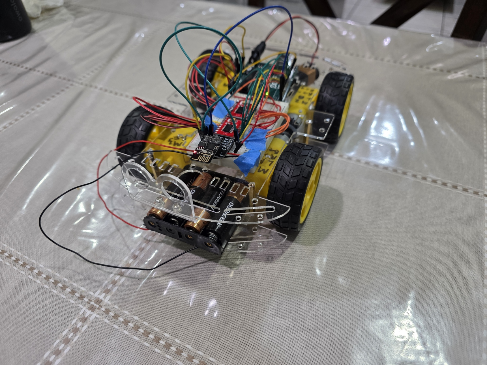
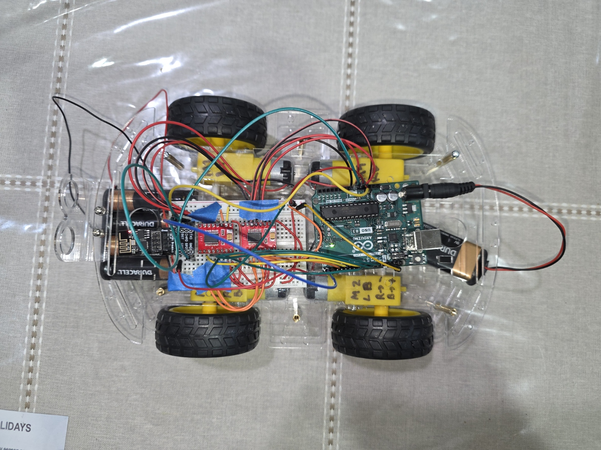

# Autonomous Robot Car with AI & Agentic Control

## Overview

This project serves as an entry point into **robotics integrated with artificial intelligence**, with the long-term goal of building a **highly autonomous robot car** capable of interpreting user commands, planning actions, and executing them in real time.

We aim to explore:
- How far autonomy can be pushed on resource-constrained hardware
- How AI agents can be used to interpret goals and generate plans
- How an **RTOS-inspired architecture** can manage tasks, priorities, and events

The project is iterative and will grow in complexity across multiple phases.

---

## Project Motivation

We are students with a **computer science background** interested in applying software, systems, and AI concepts to **real-world robotics**. Rather than focusing only on low-level motor control, this project emphasizes:

- Human–robot interaction 
- AI-driven command interpretation 
- Modular and scalable system design 
- Bridging embedded systems with modern AI tooling 

---

## Project Roadmap

### Phase 1 — Core Robot & AI Interface (Completed)
- Assemble robot car hardware 
- Enable remote control over Wi-Fi 
- Build an AI-powered interface for user interaction 
- Interpret voice commands into robot actions 

### Phase 2 — Real-Time Sensor Integration (Current Phase)
- Add ultrasonic sensor for obstacle detection 
- Add live camera feed for vision-based perception 
- Stream sensor data to higher-level software components 

### Phase 3 — Agentic & RTOS-Inspired System
- Introduce an **agentic framework** to decompose user goals into plans 
- Implement a **job/task scheduler** inspired by RTOS concepts 
- Prioritize and coordinate concurrent tasks (navigation, sensing, planning) 
- Move toward semi-autonomous and autonomous behavior 

---

## Phase 1 Details

At the current stage, we have:

- Built the physical robot car 
- Interfaced the robot with an **Arduino** 
- Connected the Arduino to an **ESP-01 Wi-Fi module** 
- Implemented basic motor control:
 - Forward
 - Backward
 - Turning
- Enabled **remote control over Wi-Fi** from a computer 

### AI Interaction Flow

1. User provides a **voice command**
2. Voice input is transcribed using **Whisper AI**
3. A lightweight **local LLM** interprets intent
4. Parsed commands are translated into robot actions
5. Commands are sent to the robot over Wi-Fi

This establishes the foundation for higher-level autonomy.

---

## System Architecture

### Physical / Electrical Components

- **Microcontroller**
 - Arduino (main control logic)

- **Wireless Communication**
 - ESP-01 (ESP8266-based Wi-Fi module)

- **Motor Control**
 - Motor driver (e.g., L298N / TB6612FNG)
 - DC motors (specific model TBD)

- **Power**
 - Battery pack (details TBD)

---

### Software Stack

#### Embedded Software
- Arduino `.ino` code
 - Motor control
 - Wi-Fi command handling
 - Low-level hardware interfacing

#### Backend
- Python backend
 - Receives user commands
 - Interfaces with AI models
 - Translates high-level intent into robot commands
 - Sends commands to Arduino over Wi-Fi (HTTP / sockets)

#### Frontend
- JavaScript frontend
 - User interface for issuing commands
 - Displays robot state and responses
 - Acts as a bridge between user and backend

#### AI Components
- **Whisper AI**
 - Speech-to-text for voice commands
- **Lightweight Local LLM**
 - Intent extraction and command interpretation
- **Local API calls**
 - No cloud dependency required

#### Communication
- **HTTP-based requests**
 - Backend ↔ Robot
 - Backend ↔ Frontend
 - Designed for modularity and future expansion

---

## Goal of Phase 1

- **Modularity** – Hardware and software components are loosely coupled 
- **Scalability** – Designed to evolve from simple control to autonomous planning 
- **Explainability** – Clear flow from user intent → AI interpretation → robot action 
- **Local-First AI** – Preference for local models and APIs over cloud dependencies 

---

## Next Steps for Phase 2

- Sensor fusion (ultrasonic + vision)
- Autonomous navigation
- Dynamic obstacle avoidance
- Task prioritization and preemption
- Multi-agent coordination (optional extension)

---
